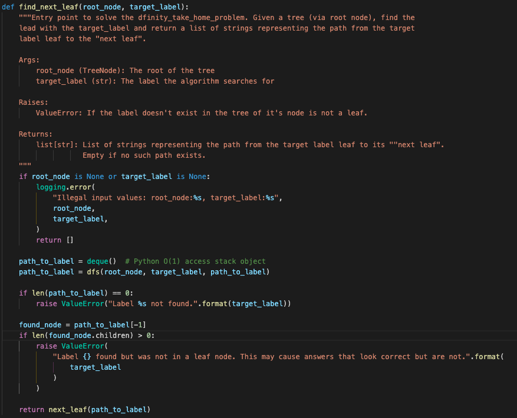
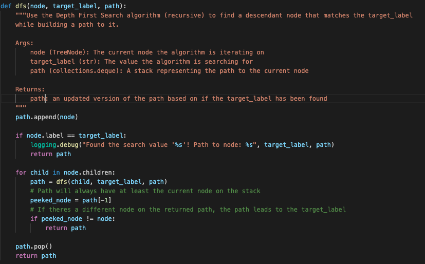
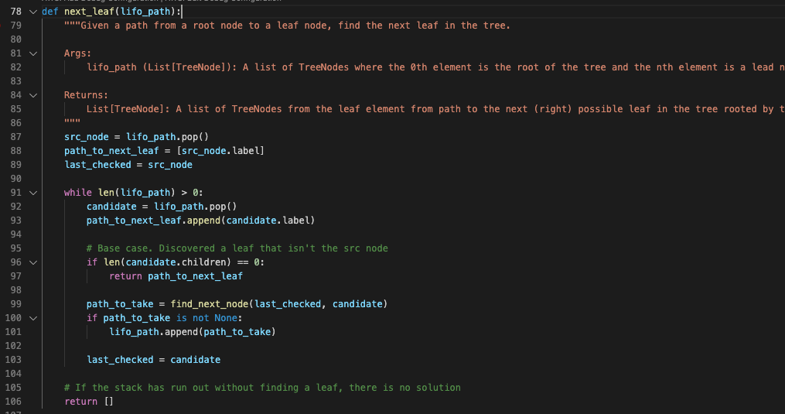
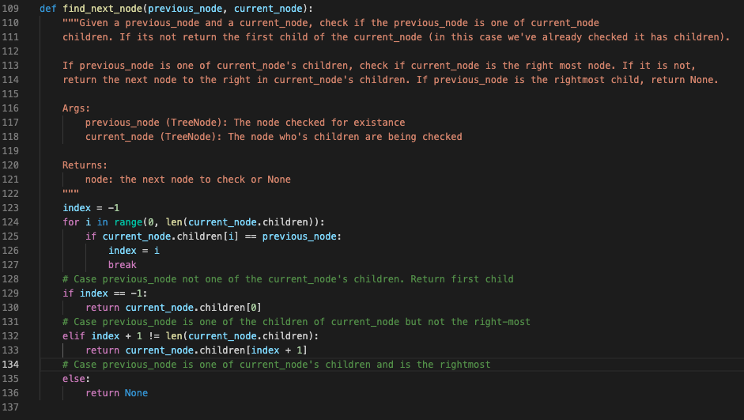

# DFinity Take Home Problem

## Overview

Hey guys! This is my solution to the take home problem. The implementation can be found in the `src/` directory and tests can be found in `tests/` directory. I'll be using this `README.md` for housekeeping, problem analysis including assumptions, problem walk through, pseudoscope, complexity analysis, tradeoffs, and code explanation. 

## Usage

If downloading the git repo paste, the following commands into your terminal

```shell
$ git clone https://github.com/DanielThurau/dfinity-take-home-problem.git
$ cd dfinity-take-home-problem
```

I used [poetry](https://python-poetry.org/), a python packaging tool, to create this python project. You can download and install it using this [guide](https://python-poetry.org/docs/#installation), but the repo also supports a system wide python install or a virtual env. I've included a requirements.txt to install any missing dependencies.

To initialize this project, `cd` into the repo and run

```shell
$ poetry init
# OR if using python + pip system wide or in a .venv
$ pip install -r requirements.txt
```

I've provided a script that will use the solution on a tree you can build inline. To run it use the following commands

```shell
$ poetry run main
# OR if using python + pip
$ python main.py
```

## Problem Statement
-----

*Below is the pasted problem statement from ryan@dfinity.org*

------

We have a tree. Each node of the tree has a label, which is some string. Write a function that given the tree and the label of a leaf node returns all node labels on the path from the leaf to the next leaf.

Example:
```
          “with” 

         /      \ 

      “luck”    “interviews”

    /   |  \  

“good” “!”  “of”

              \

              “best”
```
Examples:
- “good”: [“good”, “luck”, “!”]
- “best”: [“best”, “of”, “luck”, “with”, “interviews”]

----

## Problem Analysis

### Assumptions


So when I saw this problem I noticed a couple things from the description and the two examples. First I noted that the problem could be broken up into two different sub problems. 
1. Find a label of a **leaf** node in a tree
2. From that leaf node, find a path to the **next leaf** node

Both of these problems will influence the minimum time complexity possible, but there are some deinitions and assumptions that need to be clarified and discussed before hand.

First up are assumptions about the tree:
1. This is an N-ary tree i.e. any node can have 0..N children.
2. This **is** a tree and not a graph. This means there will be no cycles.
3. The values in the example are unique.
  
    3.1. The values do not necessarily NEED to be unique, however if the target label is not unique, there could be multiple valid answers. For simplicity of this problem, all I assume is that the target label is unique. 

4. There may or may not be a "next leaf"

Next, I needed to decide on a strict definition of what is a "next leaf". In the first example above with input "good", the next leaf is the sibling to the **right** of the target label leaf (tll). This gives the first part of the definition which denotes the direction of "next" being **left-to-right**. In the second example when given "best" as input, the next leaf is in a different subtree of the root and at a different depth level than the tll. This gives the second part of the definition, which indicates the next leaf is the **left most at any depth**. A modification of the example tree would help demonstrate why this is important.

```
                “with” 

         /                 \ 

      “luck”            “interviews”
                     
    /   |  \               /      \ 
         
“good” “!”  “of”       "Daniel"    "thanks"

              \          /

              “best”   "!"
```
Example:
- “best”: [“best”, “of”, “luck”, “with”, “interviews”, "Daniel", "!"]

In this example "!" has precedence over "thanks" as it is the left most of any leaf at any level after "best". So the definition of the "next leaf" is as follows:

> Next Leaf: A leaf to the right of the current leaf at any depth taking left precedence in subtrees.  


Finally, some assumptions about input and output for this problem. I assume that 
1. It is possible that the target label given does not exist in the tree. This will raise and exception and alert the user to the issue.
2. It is possible that a valid label can be provided to a node that is not a leaf. This will raise and exception and alert the user to the issue.
3. If the target label is the right most leaf in the tree (in the example above this would be "thanks") there is no next leaf. This will return and empty list indicating there is no path.


----

### Thoughts and Solution

So given the prompt, I identified two sub-problems. Both can eventually be solved in O(N) time complexity (where N is the number of nodes in the tree)

1. Find a label of a **leaf** node in a tree
2. From that leaf node, find a path to the **next leaf** node

For any solution, there is no way to **find** the tll in less time than O(CN) (where C is a constant) because there are no additional characteristics of the tree to assist in finding it. This means that in the worst case we would have to spend O(N) time looking at each node to check if it has the target label, and then spend more time determining the next leaf. Since O(N) is the floor, I looked for a solution that would not grow asymptotically greater than O(N). 

So if finding the target label takes O(N) time, is there additional work I can do while navigating the tree to either remain at O(N) time complexity?

There are certain things like navigating the tree backwards and keeping a path until the label is found, but it is difficult and confusing to concisely implement and explain. I opted to find the next leaf after finding the target label as my implementation will take O(N) time to find the next leaf in the worst case. I will detail these worst cases in the next section. For now this is the high level walk through of the algorithm.

```
1. Use DFS to find the target label and build a path to the leaf node from the root in the form of a stack
2.
3. Track previous node; first one is the target label leaf
4. While this stack is not empty
5.    Pop a value off the stack
6.    Check if the the value is a leaf. 
7.          If it is, next leaf has been found;return the path
8.    if the previous node is one of the children of the popped value
9.          if there a child to the right of the previous node
10.             push that child on the stack to explore next
11.         else
12.             do nothing; will need to pop the next parent off the stack
13.    else
14.         haven't explored this tree. It could either be a leaf or one of its descendants are. Push it on the stack.
15.    update previous node to what was popped last (to track positioning)
16. If the stack is exhausted, the rest of the tree to the right of the target leaf node has been explored and no leafs found
```

Its worth explaining what's going on from line 3-16. This is the core of the algorithm and how the algorithm discovers the next leaf in a prioritized and efficient way with little context. There's an important fact about trees: **If there is a sibling to the right of any node, it will either be a leaf, or one of its descendants will be a leaf.** So that means if alg has a way to navigate through ancestors of the tree(the path created by DFS), it will find a sibling to the right or it exhaust itself at the root.

Lets discuss a simple case. We have the path to the tll as [root, grandparent, parent] and treat it as a LIFO queue. If we look at the parent's children there are three cases we care about:

1. The tll has a sibling to the right. In this case, we visit the parent, find the sibling to the right of the tll, and then explore (by adding to the LIFO queue) until we find a leaf (guaranteed).
2. The tll is an only child. In this case we will need to navigate up the tree (via the LIFO queue) until one of the ancestors has a sibling to the right (guaranteed to be a leaf or have a descendant leaf) OR we exhaust the LIFO queue.
3. The tll is the right most child. Same case as #2, navigate upwards via the LIFO queue until an ancestor has a sibling to the right or it exhausts the LIFO queue.

----

### Time & Space Complexity

**Subproblem 1:** This will take O(N) time complexity to use the Depth First Search algorithm to find the the tll. The worst case is the target label is the right most leaf and dfs has to visit each node to verify. It will take worst case O(K) space (where k is the longest subtree) in the stack for the recursive calls as it will only explore a single branch entirely at a time. The worst case will be when there is a tree where there is a single line of ancestry and the last leaf is the tll. The subproblem will build and return a data structure of size O(K) (again K is the longest subtree) in memory that is an ordered list of the nodes from the root to the target label. Again rhe worst case will be when there is a tree where there is a single line of ancestry and the last leaf is the tll.

**Subproblem 2:** This will take O(N) time complexity to navigate to the next leaf as the worst case is the target label is the leftmost leaf and the next leaf is the rightmost node in the tree, forcing the algorithm to navigate the entire tree. This algorithm is not implemented recursively, but does use two data structures. The first data structure is the LIFO queue that will not grow larger than O(K) where K is the longest subtree. This is true for the implementation since for each node that is popped from it, there is a possibility of exactly one node being added to it, therefore the LIFO queue will either shrink or stay the same during the execution of the algorithm. The second data structure is worst case O(N) size and unavoidable given the problem prompt. The desired function signature returns an ordered list of type string that represents the path taken to from the tll to the next leaf. The worst case scenario for this again is the target label being the left most node and the next leaf being the rightmost node with no subtrees in between. The path would navigate through the entire tree and the data structure would have each node represented in it.

- Total Time Complexity : O(N) + O(N) -> O(2N) -> O(N)

- Total Space Complexity : O(K) + O(K) + O(N) -> O(K) + O(N)

----


### Trade Offs

Again the algorithm could be more efficient by lowering the constant time it takes past finding the label. I've detailed one such solution above. However, the small constant time tradeoff for more clear and efficient code is a worthy trade off in my opinion. Solving two sub-problems also breaks up the algorithm into clear components and allows various implementations and easier testing on both sub-problems that would not be available with a more tightly coupled solution.

In addition to time complexity, there are a few tradeoffs to be considered when it comes to space complexity. The first one would be to use Breadth First Search (BFS) instead of DFS. BFS does not use recursion and therefore does not add state to the stack while navigating the tree. While using DFS for VERY deep trees it is possible to exceed the stack bound on systems at which point switching over to BFS would be a good alternative. However, BFS does not escape its on space complexity issues. It uses a queue to track where it must explore next, and for a tree with many children at each node, the heap memory usage could become a concern. The reason I chose DFS was due to the ease of creating a path from the root to the tll using a concise recursive function. Due to the modular design of the implementation, this could still easily be switched out.

A final note on space complexity, as I mentioned in the complexity analysis section the problem prompt requires a data structure to be returned that has the path from the tll to the next leaf. In the worst case this will **massively** dwarf any other space complexity within the algorithm. While not excusing bad programming decisions when it comes to memory management, its worth knowing that the O(K) <= O(N). 

----

## Implementation Details

In this section I'll do some analysis and explanation on snippets of code from the algorithm.


### TreeNode Class

I chose to implement the tree via an individual node structure. Each node has its string label and a list referencing its children (of type TreeNode). This list is ordered so that `children[0]` is left of `children[1]`. This is how the algorithm knows what is to the "right" and therefore "next". The reference to the whole tree is via the root node, and to navigate to one of its children you must access via the children list and so on. The solution's function signature takes the a single TreeNode as input and assumes it is a root.

```python
class TreeNode:
    def __init__(self, label, children=[]):
        if label is None:
            raise ValueError("Cannot init TreeNode with no value")
        elif children is None:
            raise ValueError(
                "Cannot init TreeNode with None type for children. Consider using an empty list"
            )

        self.label = label
        self.children = children
```

----

### dfinity_take_home_problem

The solution to the problem prompt can be found in `src/dfinity_take_home_problem.py`. There are several functions in there that I will go over in turn. 


**find_next_leaf**

This is the controller of the solution. It calls functions to solve each of the individual sub-problems and verifies certain invariants hold.



----


**dfs**

This is the function that implements Depth First Search. Since python is a pass-by-value language the alg is continuously updating the path object by passing it and returning it. I use the path stack to determine if one of the descendants is the label via a neat little peak and comparison. It holds that since the function is pushing the node onto the stack at the start of the function and popping it off at the end, if the top of the stack is not the current node, the target label is one of the node's descendants and the path should just be returned with no modifications. If the target label is not unique in the tree, DFS will return the first one it finds.

This function takes O(N) time to find the target label. The path object is a `collections.deque` which provides O(1) `pop()` and `append()` methods.



----

**next_leaf**

This is the core of the algorithm and how it discovers the next leaf in a prioritized and efficient way. It starts with the tll being popped from the path as it's the last node on the stack from the dfs alg. The data structure that tracks the labels of the path  taken is initialized as `path_to_next_leaf`. 

Then the alg tracks the last_checked node which is necessary for identifying where the previous candidate would have been in the current candidate's children IF the current candidate is the parent of the previous candidate (that was a mouthful :) ). This could have been avoided if DFS encoded position as well as node in the path object it returned. This is a potential improvement as tree size grows. 

The while loop loops while the LIFO is not exhausted. The LIFO will exhaust when there is no right most sibling in any of the tll's ancestors and the root is the last candidate. The expected return value for this case is the empty list. 

During the iteration, a candidate is popped from the LIFO Queue and appended to the data structure tracking the path. This while loop is efficient and only visits nodes that will find the next leaf. When evaluating a candidate, the alg check if it is the base case of being a leaf (which is how the loop and function exits).

Then the alg evaluates which path to take through the tree. This logic is delegated to **find_next_node** but for this function, it will either return `None` which indicates the alg will need to visit and ancestor, or it will return a node to visit next. This is added to the lifo queue and the loop iterates.

This function takes O(N) time to find the next leaf. The worst case scenario is if the tll is the leftmost node and the algorithm has to traverse to the rightmost node to find the next leaf.



----

**find_next_node**

This function has the path finding logic implemented and returns a useful object. Based on the `find_leaf` there is a `current_node` and a `previous_node`, and the path to a potential leaf must be decided. There are three paths to be take:

1. If the previous_node (parent) is not a child of current_node(child of parent), then this path has already been chosen and the alg is trying to find the left most leaf. Return the left most child
2. If the previous_node (child) is a child of the current_node (child of parent), then the alg is still trying to find the next leaf. If the child is not the rightmost child, we've reached the vertex of the path and going to explore the next child in children. Return the next child
3. The previous_node (child) is the rightmost child of the current_node(child of parent), either as the original tll or an ancestor, and the alg needs to explore upwards. Return None to indicate we have to look at current_node's parent.

To find the position of the previous node within the current node's children, the alg has to loop over all the children. This will at worst take O(N) time if the tree is flat and has no child after the tll. However, in this case the algorithm exits as there are no more children to check and remains an O(N) solution. 



## Testing

I used pytest to write unit tests for the top three functions:

1. find_next_leaf
2. dfs
3. find_leaf

You can find them in `tests/` as well as few test helpers. 

You can run pytest and code coverage via the following command

```shell
$ poetry run coverage run -m pytest && poetry run coverage report -m && poetry run coverage html
# OR
$ pytest && coverage report -m && coverage html
```

And access the html report via `/<Path to repo>/dfinity-take-home-problem/htmlcov/index.html`